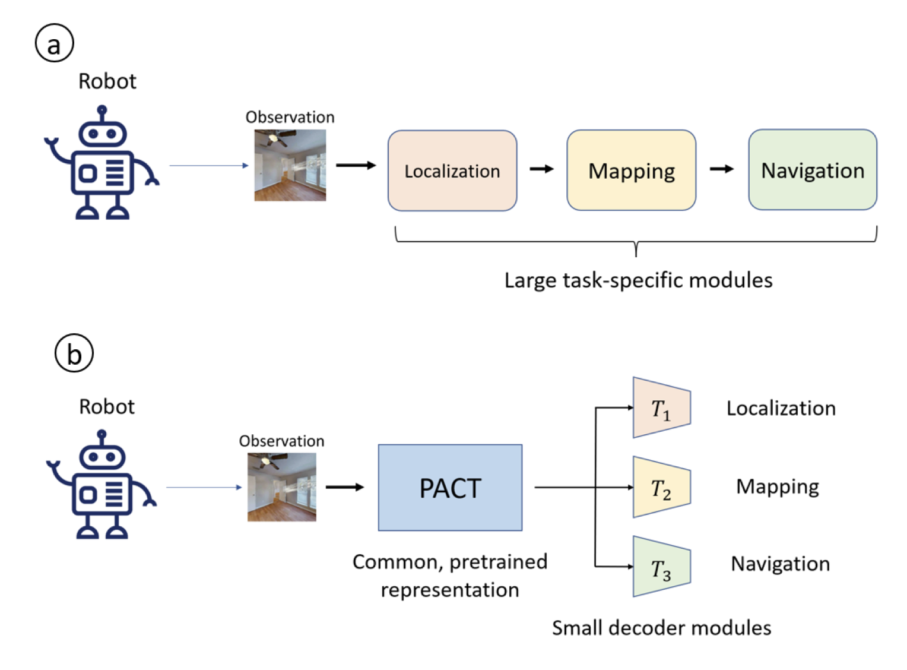
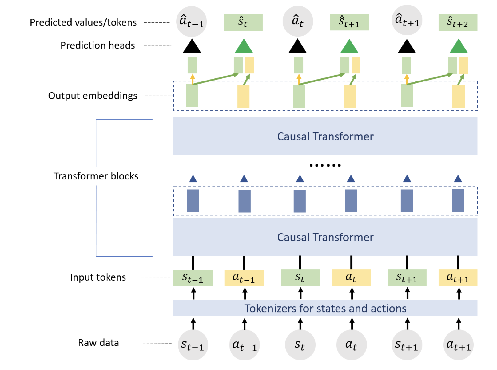
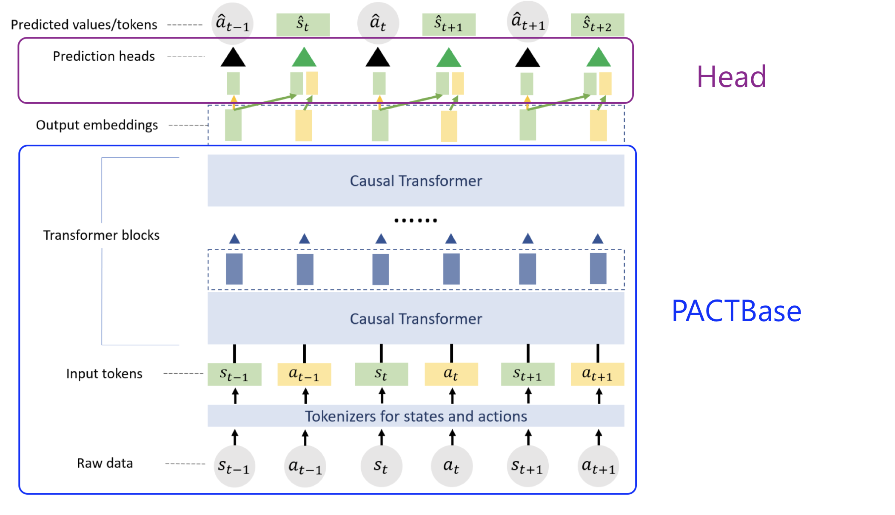

# Perception-Action Causal Transformer

This repo contains the code associated with the paper *PACT: Perception-Action Causal Transformer for Autoregressive Robotics Pre-training*. For more information, please check the [project webpage](https://www.microsoft.com/en-us/research/?post_type=msr-blog-post&p=868116) .




## Paper, video and datasets

If you use this code in an academic context, please cite the following publication:

Paper: [PACT: Perception-Action Causal Transformer for Autoregressive Robotics Pre-training](https://arxiv.org/abs/2209.11133)

Video: [YouTube](https://youtu.be/mNQvQu_atuw)

Citation:

```
@article{bonatti2022pact,
  title={Pact: Perception-action causal transformer for autoregressive robotics pre-training},
  author={Bonatti, Rogerio and Vemprala, Sai and Ma, Shuang and Frujeri, Felipe and Chen, Shuhang and Kapoor, Ashish},
  journal={arXiv preprint arXiv:2209.11133},
  year={2022}
}
```

## Setting up locally

- Using conda

  ```
  # clone this repository
  git clone git@github.com:microsoft/PACT.git

  # create env
  cd PACT
  conda env create --file docker/environment.yml

  # activate it
  conda activate pact

  # install this repo
  (pact) $ pip install -e .
  ```

## Data and models download from Azure

You can download pre-generated datasets for MuSHR and Habitat, or feel free to generate your own with the instructions that you will find later in this README.

```
# download the MuSHR dataset (approx 327 GB total including pointclouds and birds-eye-view LiDAR pseudo-images)
cd YOUR_MUSHR_DATA_DIR # the directory where you want to store the dataset
# install az copy for data download
wget https://aka.ms/downloadazcopy-v10-linux
tar -xvf downloadazcopy-v10-linux
# finally download the data
./azcopy_linux_amd64_*/azcopy copy 'https://pactrelease.blob.core.windows.net/datasets/mushr-dataset' '.' --recursive

# download the Habitat dataset (approx 4.4TB total including FPV images, depth, semantic observations, and top-down maps)
cd YOUR_HABITAT_DATA_DIR # the directory where you want to store the dataset
# install az copy for data download
wget https://aka.ms/downloadazcopy-v10-linux
tar -xvf downloadazcopy-v10-linux
# finally download the data
./azcopy_linux_amd64_*/azcopy copy 'https://pactrelease.blob.core.windows.net/datasets/habitat-dataset' '.' --recursive

# download the pre-trained models (approx 2 GB total)
cd YOUR_MODELS_DIR # the directory where you want to store the models
# install az copy for data download
wget https://aka.ms/downloadazcopy-v10-linux
tar -xvf downloadazcopy-v10-linux
# finally download the data
./azcopy_linux_amd64_*/azcopy copy 'https://pactrelease.blob.core.windows.net/datasets/models' '.' --recursive
```

# Simulators

## MuSHR Dataset

For more information on the MuSHR simulator, data generation procedures and model deployment please check the [MuSHR sim section](./mushr_sim/README.md).


## Habitat Dataset

We also provide the dataset collected from the [Habitat simulator](https://aihabitat.org/docs/habitat-sim/). We use 10 environments in Habitat from the [HM3D dataset](https://aihabitat.org/datasets/hm3d/), and sample random valid start and goal locations for the agent. Using Habitat’s built-in shortest path function to generate the agent’s actions, we record a total of 800K perception-action pairs consisting of RGB images of size 224x224 with their respective discrete actions (left turn, right turn, go forward, stop). We also record the local occupancy maps in the neighborhood of the agent at every step.

# Training and fine-tuning PACT

## Running the code

- Mount the data data storage at your desired directory and then change the `dataset_dir_entry` parameter within `configs/<dataset>_<task>.yaml` to mounted one. Dataset can be either mushr/habitat, and the task can be pretrain/localization/mapping. For example, to pretrain a PACT model on the MuSHR dataset, choose `mushr_pretrain.yaml`

- Set the right JSON filenames for `train_ann_file_name` and `val_ann_file_name` in the configuration YAML.

- Adjust any other hyper-parameters for training or model size in the same YAML file. You can also adjust the dataset size for training and validation with `train_dataset_fraction`.

- Run the code as

  `python src/train.py base=configs/mushr_pretrain.yaml`

## Usage Notes

The code for training PACT is powered by PyTorch Lightning. The codebase is organized as follows:

```
├── configs
|   ├── *.yaml
├── src
|   ├── train.py
|   ├── datamodules
|   ├── models
|   |   ├── localization.py
|   |   ├── mapping.py
|   |   ├── pretrain.py
|   |   ├── modules
|   |   |    ├── decoder_utils.py
|   |   |    ├── minGPT.py
|   |   |    ├── modeling_pact.py
|   |   |    ├── tokenizer_pact.py
|   |   |    ├── tokenizer_utils.py
```
The configuration of the dataset/dataloader, model, and the training strategy are set up through YAML files located in `configs/`.

Each task (pretraining, localization, mapping) is defined through a separate Python script which creates a LightningModule. The modules share a common underlying structure:



1. PACTBase(nn.Module): This module consists of a tokenizer and GPT (minGPT) module for the causal Transformer. The input to this module is raw sequences of states (observations) and actions. The data is tokenized through the appropriate tokenizers, and the final output is sequence embedding vectors. As the name indicates, this is a universal submodule of every PACT task.
   - PACT tokenizer (nn.Module): this is a module that automatically tokenizes each type of input according to the config file (currently configs/*.yaml). The `model.input_config` section in the YAML indicates the state and action data configurations.
   
2. Head (nn.Module): Given output embeddings, it performs task-specifc operations. For example, the pretraining module contains state embedding and action prediction heads, whereas the localization module contains a pose prediction head.

These core modules, along with other functionality such as optimizer configuration, can be seen in `src/models/modules/modeling_pact.py`).
To define a new downstream task, you would need to specify a new head module and its corresponding loss function(s).

### Use Pretrained PACT Model

To initialize the PACT model (tokenizer + GPT) from pretrained weights, set `from_pretrained` to `True` in `model.pretrain_config`
in the configuration yaml, and `load_ckpt_path` to the path of the desired checkpoint. Optionally, `freeze_base` can be set to `True`
to fix the PACT base weights when finetuning.

```
      from_pretrained: True
      load_ckpt_path: "{path_to_checkpoint_saved_by_lightning}"
      # e.g. "${trainer.default_root_dir}/checkpoints/last.ckpt"
      freeze_base: True
      # True if you want loaded pretrained weights fixed in later use (e.g., finetuning)
```

The parts loaded with pretrained weights are set to `eval()` mode by default.

### Other notes

- The configuration of the GPT model (such as embedding size, number of blocks) resides in the `model.gpt_config` section.
- The length of the input sequence can be set through `data.train_params.clip_len`.
- We provide a set of basic Lightning callbacks for use during training such as early stopping, model checkpointing etc. See `trainer.callbacks`.
- By default, the configuration attempts to scale the training to the number of GPUs available on your machine. If you run it on a multi-GPU machine, training is done using the DistributedDataParallel strategy.

## Contributing

This project welcomes contributions and suggestions.  Most contributions require you to agree to a
Contributor License Agreement (CLA) declaring that you have the right to, and actually do, grant us
the rights to use your contribution. For details, visit https://cla.opensource.microsoft.com.

When you submit a pull request, a CLA bot will automatically determine whether you need to provide
a CLA and decorate the PR appropriately (e.g., status check, comment). Simply follow the instructions
provided by the bot. You will only need to do this once across all repos using our CLA.

This project has adopted the [Microsoft Open Source Code of Conduct](https://opensource.microsoft.com/codeofconduct/).
For more information see the [Code of Conduct FAQ](https://opensource.microsoft.com/codeofconduct/faq/) or
contact [opencode@microsoft.com](mailto:opencode@microsoft.com) with any additional questions or comments.

## Trademarks

This project may contain trademarks or logos for projects, products, or services. Authorized use of Microsoft 
trademarks or logos is subject to and must follow 
[Microsoft's Trademark & Brand Guidelines](https://www.microsoft.com/en-us/legal/intellectualproperty/trademarks/usage/general).
Use of Microsoft trademarks or logos in modified versions of this project must not cause confusion or imply Microsoft sponsorship.
Any use of third-party trademarks or logos are subject to those third-party's policies.
