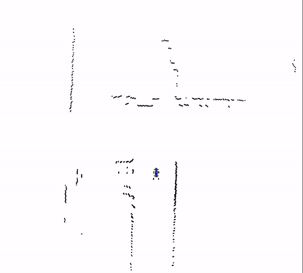
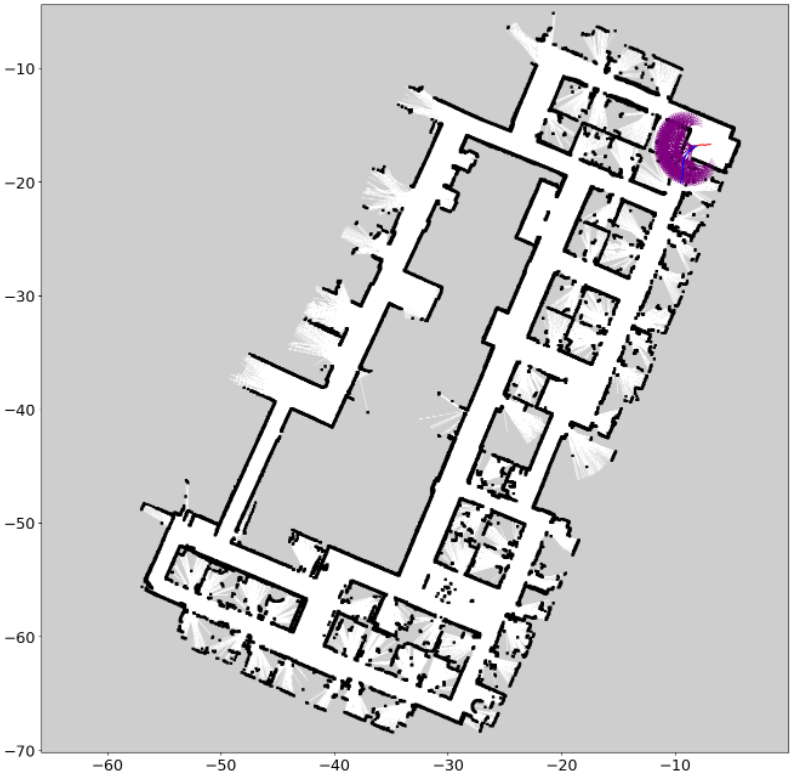

# MuSHR simulator

## Simulator overview

Our MuSHR simulator is inpired by the [open-sourced project](https://mushr.io/tutorials/quickstart/) from the University of Washington.
While the original simulator used in the PACT paper was based on ROS, we have re-implemented it in Python using a structure simular to Gym environments.
This re-implementation allows us to use the simulator in a more flexible way for data generation at scale.
Under the hood we use a MPC controller with a trajectory library to generate trajectories for the car. This controller weighs the collision cost of the trajectory, the cost of the control input, and distance to the goal location to generate a smooth trajectory.

There are 3 main outputs from the simulator: the pointcloud (XY coordinate of 720 points captured at each scan, at equal angular intervals), the birds-eye-view LiDAR pseudo-image, and the actions that the car took. The first two data modalities are stored in .npy files, and the third is stored in a .json file.




## Simulator setup

To set up the simulator and its dependencies, run the following commands:

```
git submodule update --init --recursive
cd mushr_sim/range_libc/pywrapper
WITH_CUDA=ON python setup.py install
```

## Dataset Generation

To generate a MuSHR dataset yourself, run the following command:

```
cd PACT/mushr_sim
python mushr_env.py --n_episodes 10 --nt 500 --dt 0.1
```

A few main parameters that you might want to change are:

- `--libc_method`: The LiDAR raycasting method. If you get an error 
- `--n_episodes`: The number of episodes to run
- `--nt`: The number of time steps per episode
- `--dt`: The time step length, in seconds
- `--viz_last`: If this flag is set, then the last final time step will be visualized as an image. This is useful for debugging, but should be turned off for generating large datasets because it slows down the data generation process.

Other important parameters are:

- `viz_freq`: The frequency at which to visualize the simulation. By default it is 1000, which means that the trajectory will rarely be visualized. This is used for debugging (for example if set at 1).
- `--seg_len`: The time length of trajectory planning segments. The default is 5.
- `--deltas`: The min and max angles for the wheels, in rad. The default is \[-0.34, 0.34\].
- `--vs`: The velocities for the wheels, in m/s. The default is \[2.5, 2.5\], which indicates a constant velocity of 2.5 m/s.

After the run you should see a printed message that looks like this:


<!--  -->

- Average len: the average length of the trajectories generated. It will be upper-bounded by the `--nt` parameter, but can be smaller if the car achieves its goal earlier.
- FPS: Should be around or larger than 100 FPS using the default parameters if you use GPU acceleration for ray casting

Once all data is generated, you can use the `merge_jsons.py` script to process the data from multiple runs into a single file to be consumed for model training:

```
python merge_jsons.py
```

## Dataset Visualization

Once a run is finalized, the debugging data will be saved in the `viz` folder of its corresponding run.
There, depending on the args you use, you will be able to visualize the final trajectory and debugging steps. Note that viz will make the data generaiton process much slower: 

```
python mushr_env.py --n_episodes 2 --nt 30 --dt 0.1  --viz_freq 1
```

<!-- 
 -->




## Data processing and parallelization

To generate a large dataset, we recommend running multiple simulation instances in parallel in multiple threads in a single machine, or using multiple machines in a cluster.
Make sure all data is saved to the same base folder. Then, you can use the `merge_jsons.py` script to process the data into a single file: `python merge_jsons.py`.

## How much data do I need?

We provide a dataset for download at an Azure storage account with approximately 2 million state-action pairs from 12K trajectories. This dataset is enough to train a PACT model from scratch and achieve good performance on the MuSHR car, but smaller or larger datasets can also be used to pre-train a model for transfer learning.


## MuSHR model deployment in the simulator

Once training is finalized, you can visualize the model's output by running the model deployment code:

```
cd PACT/mushr_sim
python mushr_deploy_env.py --n_episodes 5
```

You can modify the path for the navigation model and number of episodes to run in the `mushr_deploy_env.py` file. 
Visualizations will be saved in the `viz` folder of the corresponding run.
In the future we plan on including visualization tools for the downstream tasks as well.


## Acknowledgements

We would like to thank [Yue Meng](https://mengyuest.github.io) for his help with the creation of this simulator. 
